# Aquatics Empowered — 2-Week MVP Foundation

Continues the [prior Claude chat](https://claude.ai/share/6d31062f-a1df-4462-b56e-1374a7e8063f). All architectural decisions from that chat are preserved; this plan delivers a tight 2-week MVP foundation to the empty [tderheim25/aquaticsempowered](https://github.com/tderheim25/aquaticsempowered) repo. Per-feature pages ship as individual PRs after MVP using GitHub Flow.

---

## 1. MVP Scope (what 2 weeks delivers)

**In scope (MVP v0.1.0):**

- Next.js 15 + TypeScript + MUI v6 + Emotion app, deployed on Vercel
- Supabase project wired (browser, server, admin clients) with 8-table schema + RLS
- Auth: magic link via Supabase + Resend (login, signup, forgot, callback, logout)
- Marketing landing `/` + founder signup `/founders` (lead capture → Resend welcome email)
- Auth-gated `(dashboard)` shell with one placeholder page so post-login routing works
- CI: GitHub Actions (lint + typecheck + build), Vercel auto-deploys
- Docs: README, CONTRIBUTING (GitHub Flow), .env.example

**Deferred to per-feature tickets** (each = its own branch + PR after MVP):

- All 10 dashboard feature pages (chemical-logs, maintenance, support, vendors, community, procurement, training, monitoring + admin + vendor portal)
- Stripe checkout for founder memberships → `feat/stripe-checkout`
- Twilio SMS → Phase 3
- IoT ingestion + Realtime monitoring → Phase 3

---

## 2. Locked Architecture (from prior chat + workflow PDF)

- **Frontend:** Next.js 15 App Router + TypeScript + MUI v6 + Emotion
- **Backend:** Supabase (Postgres + RLS + Auth + Storage + Realtime + Edge Functions + pgvector)
- **Hosting:** Vercel | **Email:** Resend | **Billing:** Stripe (post-MVP) | **SMS:** Twilio (Phase 3) | **Analytics:** PostHog | **Errors:** Sentry
- **Multi-tenancy:** every table carries `org_id`; isolation enforced by Supabase RLS at DB layer.
- **RBAC:** 5 roles — `super_admin`, `org_admin`, `manager`, `staff`, `vendor`.
- **Plan gating:** middleware reads `subscriptions.plan`, gates routes.
- **Bumped:** Next.js 14 → 15 (current stable; App Router patterns identical).

```mermaid
flowchart TB
  subgraph users [User Layer]
    direction LR
    fm["Facility Manager (Essential / Pro)"]
    cpo["Admin / CPO (Enterprise)"]
    vend["Certified Vendor (Partner portal)"]
    comm["Community (Free tier)"]
    sa[Super Admin]
  end

  subgraph frontend [Frontend - Next.js 15 + MUI v6 on Vercel]
    direction LR
    dashboard[Dashboard]
    chemlogs[Chemical Logs]
    maint[Maintenance]
    support[Support Center]
    vdir[Vendor Directory]
    community[Community]
    proc[Procurement]
    train[Training / CPO]
    monitor[Monitoring]
    adminPanel[Admin Panel]
  end

  subgraph api [API Layer - Route Handlers / Edge Functions]
    direction LR
    authApi["Auth API (JWT + RBAC)"]
    facApi["Facilities API (Logs + SOPs)"]
    billApi["Billing API (Stripe webhooks)"]
    vendApi["Vendor API (Certs + leads)"]
    notifyApi["Notify API (Email + SMS)"]
    iotApi["IoT API (Sensor ingest)"]
  end

  subgraph backend [Supabase Backend]
    direction LR
    pg[("PostgreSQL + RLS")]
    sbAuth["Auth (Magic link + OAuth)"]
    sbStorage["Storage (Docs + Certs)"]
    sbRealtime["Realtime (Live alerts)"]
    sbEdge["Edge Functions (Webhooks + Cron)"]
    sbDbfn["DB Functions (Aggregations)"]
    pgv["pgvector (AI search - Stage 2)"]
  end

  subgraph third [Third-Party Integrations]
    direction LR
    stripe[Stripe]
    resend[Resend]
    twilio[Twilio]
    mqtt["IoT / MQTT"]
    cdn["Vercel CDN"]
    posthog[PostHog]
  end

  users --> frontend
  frontend --> api
  api --> backend
  api --> third
  backend --> third
```



---

## 3. Repo Structure at End of MVP

Single Next.js 15 App Router app at repo root. (Per-feature pages get added as their own folders inside the route groups later.)

```
aquaticsempowered/
├── .github/workflows/ci.yml
├── .env.example
├── README.md
├── CONTRIBUTING.md
├── docs/
│   ├── architecture.md           # workflow mermaid + ADRs
│   ├── database-schema.md        # 8 tables + relationships
│   └── rbac-and-tiers.md         # role x plan matrix
├── supabase/
│   ├── migrations/
│   │   ├── 0001_init.sql         # 8 core tables + plans + leads + enums
│   │   ├── 0002_rls.sql          # RLS policies (org_id isolation)
│   │   └── 0003_functions.sql    # current_org_id() + current_role() + auth hook
│   └── seed.sql                  # plan rows + dev fixture org
├── src/
│   ├── app/
│   │   ├── (marketing)/
│   │   │   ├── page.tsx          # /  landing
│   │   │   ├── founders/page.tsx # founder signup form
│   │   │   └── layout.tsx
│   │   ├── (auth)/
│   │   │   ├── login/page.tsx
│   │   │   ├── signup/page.tsx
│   │   │   ├── forgot/page.tsx
│   │   │   └── callback/route.ts
│   │   ├── (dashboard)/app/
│   │   │   ├── page.tsx          # placeholder "Welcome" landing
│   │   │   └── layout.tsx        # AppBar + drawer + auth-gated
│   │   ├── api/
│   │   │   └── notify/founder-welcome/route.ts  # Resend trigger
│   │   └── layout.tsx            # root: theme + Sentry + PostHog
│   ├── components/
│   │   ├── marketing/            # Hero, ValueProps, PricingTeaser, FounderForm
│   │   ├── auth/                 # MagicLinkForm, AuthLayout
│   │   └── dashboard/            # AppBar, DrawerNav (stub)
│   ├── lib/
│   │   ├── supabase/{client,server,admin,middleware}.ts
│   │   ├── resend.ts
│   │   ├── posthog.ts
│   │   ├── sentry.ts
│   │   └── auth/{rbac,plans}.ts  # skeleton helpers
│   ├── theme/                    # MUI palette, typography, spacing tokens
│   ├── types/database.ts         # generated via `supabase gen types`
│   ├── middleware.ts             # session refresh + auth gate /app/**
│   └── emails/FounderWelcome.tsx # React Email template
├── package.json
├── tsconfig.json
└── next.config.ts
```

---

## 4. Database — SQL the user runs in Supabase SQL Editor

Three files, run in order. After each, run `supabase gen types typescript --project-id $SUPABASE_PROJECT_ID > src/types/database.ts` to regenerate types.

**`supabase/migrations/0001_init.sql`** — schema only:

- Enums: `org_tier` (rural, municipal, hotel, school, hospital, hoa, splash_pad, wellness, commercial, therapy), `user_role` (super_admin, org_admin, manager, staff, vendor), `plan_code` (free, essential, pro, enterprise), `task_status`, `task_priority`, `ticket_status`.
- **plans** — `code (pk plan_code), name, monthly_cents, annual_cents, features jsonb, sort_order` — seeded with the 4 tiers.
- **organizations** — `id (uuid pk), name, tier (org_tier), address jsonb, plan_code (fk plans), founder boolean default false, created_at`.
- **users** — `id (uuid pk = auth.uid), org_id (fk), role (user_role), email, full_name, created_at`.
- **subscriptions** — `id, org_id (fk), plan_code (fk), stripe_customer_id, stripe_subscription_id, status, current_period_start, current_period_end`.
- **chemical_logs** — `id, org_id (fk), pool_label, ph numeric, free_chlorine numeric, total_chlorine numeric, alkalinity numeric, temp_f numeric, logged_by (fk users), logged_at timestamptz default now()`.
- **maintenance_tasks** — `id, org_id (fk), title, description, status (task_status), priority (task_priority), assigned_to (fk users), due_date, created_at`.
- **support_tickets** — `id, org_id (fk), subject, body, status (ticket_status), priority (task_priority), assigned_to (fk users), created_by (fk users), created_at`.
- **vendors** — `id, name, tier text, category text, region text, certified_at timestamptz, contact jsonb, listing_visible boolean default true`.
- **sensor_readings** — `id, org_id (fk), device_id text, metric text, value numeric, unit text, recorded_at timestamptz` (Phase 3 — table exists for forward-compat).
- **leads** — `id, facility_name, facility_tier (org_tier), contact_name, email, phone, num_pools int, current_pain text, source text default 'founder_form', created_at`.

**`supabase/migrations/0002_rls.sql`** — RLS policies. Enable RLS on every table. Pattern:

```sql
alter table chemical_logs enable row level security;

create policy "select_own_org" on chemical_logs
  for select using (org_id = public.current_org_id());

create policy "write_own_org" on chemical_logs
  for all using (org_id = public.current_org_id())
  with check (org_id = public.current_org_id());
```

`leads` table is insert-only-public (anyone can submit a founder form; no select for non-admin):

```sql
create policy "anon_can_insert_leads" on leads for insert to anon with check (true);
create policy "super_admin_can_read_leads" on leads for select using (public.current_role() = 'super_admin');
```

**`supabase/migrations/0003_functions.sql`** — JWT helpers + auth hook:

```sql
create or replace function public.current_org_id() returns uuid
  language sql stable as $$ select nullif(current_setting('request.jwt.claims', true)::jsonb ->> 'org_id', '')::uuid $$;

create or replace function public.current_role() returns text
  language sql stable as $$ select current_setting('request.jwt.claims', true)::jsonb ->> 'user_role' $$;

create or replace function public.custom_access_token_hook(event jsonb) returns jsonb
  language plpgsql as $$
declare claims jsonb; u record;
begin
  select org_id, role into u from public.users where id = (event -> 'user_id')::uuid;
  claims := event -> 'claims';
  if u.org_id is not null then claims := jsonb_set(claims, '{org_id}', to_jsonb(u.org_id::text)); end if;
  if u.role is not null then claims := jsonb_set(claims, '{user_role}', to_jsonb(u.role::text)); end if;
  return jsonb_set(event, '{claims}', claims);
end $$;
```

Then in Supabase dashboard: **Authentication → Hooks → Customize Access Token (JWT) Claims** → select `public.custom_access_token_hook`.

---

## 5. `.env.example` (MVP-required vars marked)

```bash
NEXT_PUBLIC_SITE_URL=http://localhost:3000

# REQUIRED (MVP)
NEXT_PUBLIC_SUPABASE_URL=
NEXT_PUBLIC_SUPABASE_ANON_KEY=
SUPABASE_SERVICE_ROLE_KEY=
SUPABASE_PROJECT_ID=

# REQUIRED (MVP)
RESEND_API_KEY=
RESEND_FROM_EMAIL=hello@aquaticsempowered.com

# OPTIONAL (post-MVP - feat/stripe-checkout)
STRIPE_SECRET_KEY=
STRIPE_WEBHOOK_SECRET=
NEXT_PUBLIC_STRIPE_PUBLISHABLE_KEY=
STRIPE_PRICE_FOUNDER_ANNUAL=

# OPTIONAL (Phase 3)
TWILIO_ACCOUNT_SID=
TWILIO_AUTH_TOKEN=
TWILIO_FROM_NUMBER=

# OPTIONAL (recommended)
NEXT_PUBLIC_POSTHOG_KEY=
NEXT_PUBLIC_POSTHOG_HOST=https://us.i.posthog.com
SENTRY_DSN=
SENTRY_AUTH_TOKEN=
```

---

## 6. GitHub Flow (team workflow)

Repo: [tderheim25/aquaticsempowered](https://github.com/tderheim25/aquaticsempowered).

- **`main` is protected.** Always deployable. Vercel deploys main → production.
- **Every change = a short-lived branch off `main`.** Naming:
  - `feat/<area>-<short>` — new feature (e.g., `feat/chemical-logs`)
  - `fix/<short>` — bug fix
  - `chore/<short>` — tooling/CI/docs
- **PR workflow:**
  1. Push branch, open PR against `main`
  2. Vercel posts a preview URL on the PR
  3. CI runs lint + typecheck + build
  4. Other dev reviews → approve → squash merge → branch auto-deletes
  5. Vercel deploys main → production
- **Commit style:** Conventional Commits (`feat:`, `fix:`, `chore:`, `docs:`).
- **Branch protection:** require 1 approval + green CI before merge to main.

---

## 7. 2-Week Day-by-Day Schedule

Each day lists Dev A tasks and Dev B tasks side-by-side with named features, components, and files. Day 1 front-loads the entire database setup to Dev A so the schema is fully live before any code touches it.

### Week 1

---

**Day 1 (Mon) — Database Setup + Project Scaffold**

*Dev A (Database + Accounts):*
- Create Supabase project (region close to target users; capture `project_id`, anon key, service-role key, JWT secret)
- Create Resend account; generate API key; add and verify sending domain (`aquaticsempowered.com`)
- Run `supabase/migrations/0001_init.sql` in Supabase SQL Editor — creates enums (`org_tier`, `user_role`, `plan_code`, `task_status`, `task_priority`, `ticket_status`) and all 10 tables (`plans`, `organizations`, `users`, `subscriptions`, `chemical_logs`, `maintenance_tasks`, `support_tickets`, `vendors`, `sensor_readings`, `leads`)
- Run `supabase/migrations/0002_rls.sql` — enables RLS on every table and applies `org_id` isolation policies + anon-insert policy on `leads` + super_admin-read on `leads`
- Run `supabase/migrations/0003_functions.sql` — creates `current_org_id()`, `current_role()`, and `custom_access_token_hook(event)`
- Supabase Dashboard → Authentication → Hooks → "Customize Access Token (JWT) Claims" → select `public.custom_access_token_hook`
- Supabase Dashboard → Authentication → SMTP → switch to Resend (host: `smtp.resend.com`, port 465, user `resend`, pass = Resend API key, from = verified domain)
- Hand off credentials to Dev B for `.env.local` and Vercel env config

*Dev B (Code Scaffold):*
- `pnpm create next-app aquaticsempowered` — TypeScript, App Router, `src/` directory, ESLint, no Tailwind
- Install runtime deps: `@mui/material @emotion/react @emotion/styled @mui/icons-material @mui/material-nextjs @supabase/ssr @supabase/supabase-js zod react-hook-form @hookform/resolvers resend @react-email/components`
- Install dev deps: `prettier eslint-config-prettier @types/node`
- Configure ESLint flat config + Prettier; add `lint`, `typecheck`, `build` npm scripts
- Author the 3 SQL migration files (commit them as plain `.sql` so Dev A can copy/paste)
- `git init`; first commit `chore: scaffold Next.js 15 + MUI v6 + Supabase migrations`
- Set remote to `https://github.com/tderheim25/aquaticsempowered`; push `main`
- Link Vercel project to repo (auto-detect Next.js)
- Create `.env.example` documenting all variables
- Once Dev A delivers credentials: run `npx supabase gen types typescript --project-id $SUPABASE_PROJECT_ID > src/types/database.ts`, commit

*Branches/PRs:* single `chore/scaffold` PR covering everything Day 1.

---

**Day 2 (Tue) — Supabase Clients + MUI Theme**

*Dev A:*
- `src/theme/index.ts` — aquatic-themed palette (primary `#003B6F` deep blue, secondary `#2EA5A0` teal, neutrals); typography (Inter or system stack); spacing scale; component overrides for `MuiButton`, `MuiTextField`, `MuiCard`
- Sync env vars to Vercel (Preview + Production scopes) using credentials from Day 1
- *Branch:* `feat/mui-theme`

*Dev B:*
- `src/lib/supabase/client.ts` — browser client (`createBrowserClient`)
- `src/lib/supabase/server.ts` — RSC server client (`createServerClient` reading `cookies()`)
- `src/lib/supabase/admin.ts` — service-role client; throws if imported outside server
- `src/lib/supabase/middleware.ts` — session refresh helper for `src/middleware.ts`
- Verify `src/types/database.ts` is up-to-date and importable in both client and server contexts
- Temporary `/dev/test-auth` page (gated by `NODE_ENV !== 'production'`) to verify session round-trip
- *Branch:* `feat/supabase-clients`

---

**Day 3 (Wed) — Root Layout + Email + Observability Stubs**

*Dev A:*
- `src/app/layout.tsx` — root layout with `<AppRouterCacheProvider>` + `<ThemeProvider>` (MUI v6 + Emotion SSR via `@mui/material-nextjs`)
- `src/app/(marketing)/layout.tsx` — marketing chrome: header (logo + nav: Home / Pricing / Vendors / Community / Founder Program / Login) + footer (legal, contact, social)
- `src/components/marketing/SiteHeader.tsx`, `src/components/marketing/SiteFooter.tsx`
- *Branch:* `feat/root-layout`

*Dev B:*
- `src/lib/resend.ts` — typed `send({ template, to, props })` wrapper with template registry
- `src/emails/MagicLink.tsx` — branded React Email magic-link template
- `src/lib/posthog.ts` — env-gated client init (no-op when `NEXT_PUBLIC_POSTHOG_KEY` missing)
- `src/lib/sentry.ts` — env-gated init (no-op when `SENTRY_DSN` missing)
- *Branch:* `feat/email-observability`

---

**Day 4 (Thu) — Auth Pages**

*Dev A:*
- `src/components/auth/AuthLayout.tsx` — split-pane layout (brand panel left, form right)
- `src/components/auth/MagicLinkForm.tsx` — email field + submit + states (idle/loading/sent/error)
- `src/app/(auth)/login/page.tsx` — uses `MagicLinkForm`
- `src/app/(auth)/signup/page.tsx` — same form + collects `full_name`
- `src/app/(auth)/forgot/page.tsx` — magic-link reissue
- `src/app/(auth)/check-email/page.tsx` — confirmation screen ("We sent you a link")
- *Branch:* `feat/auth-ui`

*Dev B:*
- `src/app/(auth)/callback/route.ts` — handles `?code=` exchange → session, redirects to `/app`
- Test full email round-trip end-to-end
- `docs/auth-flow.md` — sequence diagram + RLS notes
- *Branch:* `feat/auth-callback`

---

**Day 5 (Fri) — Middleware + RBAC + Week 1 Demo**

*Dev A:*
- Auth UI polish — error toasts (MUI `Snackbar`), success animations, mobile-breakpoints pass
- Demo prep — short Loom or screenshots of marketing layout + auth flow for stakeholders
- *Branch:* `chore/auth-polish`

*Dev B:*
- `src/middleware.ts` — runs on every request: refreshes Supabase session; redirects unauth from `/app/**` → `/login?next=`; redirects authed from `(auth)/**` → `/app`
- `src/lib/auth/rbac.ts` — `getCurrentUser()`, `requireRole(role)`, `requireOrg()` server helpers
- `src/lib/auth/plans.ts` — `PLAN_FEATURES` map (free/essential/pro/enterprise → boolean flags) + `hasFeature(plan, feature)` helper
- *Branch:* `feat/middleware-rbac`

### Week 2

---

**Day 6 (Mon) — Marketing Landing**

*Dev A:*
- `src/components/marketing/Hero.tsx` — headline "The operating system for aquatic facilities" + subhead + CTA → `/founders`
- `src/components/marketing/ValueProps.tsx` — 3-column grid: Protect Pools / Cut Costs / Prevent Failures (icons + copy from blueprint)
- `src/components/marketing/PricingTeaser.tsx` — 4-tier compact pricing card row (Free / Essential $149 / Pro $499 / Enterprise)
- `src/components/marketing/FounderCTA.tsx` — full-width banner CTA to `/founders`
- `src/app/(marketing)/page.tsx` — composes Hero + ValueProps + PricingTeaser + FounderCTA
- *Branch:* `feat/landing-page`

*Dev B:*
- Wire PostHog `capture('page_view')` in marketing layout + `capture('cta_click_founders')` on CTA buttons
- Sentry test error boundary on hidden `/dev/sentry-test` (gated by env flag) to verify pipeline
- *Branch:* `feat/analytics-events`

---

**Day 7 (Tue) — Founder Form UI + Server Action Skeleton**

*Dev A:*
- `src/lib/validations/founder.ts` — Zod schema: `facility_name`, `facility_tier` (enum), `contact_name`, `email`, `phone?`, `num_pools?`, `current_pain?`
- `src/components/marketing/FounderForm.tsx` — `react-hook-form` + Zod resolver; MUI fields; loading/error states
- `src/app/(marketing)/founders/page.tsx` — page composition (form + benefits sidebar listing founder perks from blueprint)
- *Branch:* `feat/founder-form-ui`

*Dev B:*
- `src/app/(marketing)/founders/_actions.ts` — `submitFounderLead(input)` server action skeleton: re-validates with Zod; returns `{ ok: boolean, error?: string }`
- Verify anon-role insert into `leads` works against the deployed Supabase project
- *Branch:* `feat/founder-action-skeleton`

---

**Day 8 (Wed) — Founder Flow End-to-End**

*Dev A:*
- Wire `FounderForm` to call `submitFounderLead`; show loading + redirect on success
- `src/app/(marketing)/founders/thanks/page.tsx` — success page ("You're in. Watch your inbox.") + next-steps + social CTAs
- Mobile QA pass (iPhone Safari + Android Chrome)
- *Branch:* `feat/founder-form-wire`

*Dev B:*
- `src/emails/FounderWelcome.tsx` — branded React Email with founder benefits + calendar link
- Wire `submitFounderLead` to: insert row into `leads` → call `resend.send('FounderWelcome', { to, props })` → return success
- `Sentry.captureException` on action failures
- *Branch:* `feat/founder-welcome-email`

---

**Day 9 (Thu) — Dashboard Shell**

*Dev A:*
- `src/components/dashboard/AppBar.tsx` — top bar: logo + breadcrumb + user avatar menu (profile, logout)
- `src/components/dashboard/DrawerNav.tsx` — left drawer with 10 nav items (Dashboard / Chemical Logs / Maintenance / Support / Vendor Directory / Community / Procurement / Training / Monitoring / Admin); only Dashboard active, others show "Coming soon" badge and are disabled
- `src/app/(dashboard)/app/layout.tsx` — composes AppBar + DrawerNav + content area
- `src/app/(dashboard)/app/page.tsx` — placeholder welcome ("Welcome, {name}. Your dashboard is being built.") with org name + plan badge
- *Branch:* `feat/dashboard-shell`

*Dev B:*
- Verify middleware auth-gate on `/app/**` (manual + automated test)
- `signOut` server action calling `supabase.auth.signOut()` → redirect to `/`
- Full journey smoke test: `/` → `/founders` → `/founders/thanks` → `/login` → email link → `/app` → logout → `/`
- *Branch:* `feat/dashboard-auth-wire`

---

**Day 10 (Fri) — CI/CD + Production Deploy + Tag**

*Dev A:*
- Visual QA on Vercel production URL (desktop + mobile)
- Capture screenshots for marketing handoff
- Update `README.md` with screenshots, setup instructions, and project links
- *Branch:* `docs/readme-screenshots`

*Dev B:*
- `.github/workflows/ci.yml` — runs on PRs: `pnpm install --frozen-lockfile && pnpm lint && pnpm typecheck && pnpm build`
- Configure GitHub branch protection on `main` (require PR + 1 approval + green CI; no force-push)
- Configure Vercel: production branch = `main`; preview = all PRs; env vars synced to both scopes
- Smoke test prod URL: founder lead lands in `leads` table + welcome email arrives within 30 seconds
- Tag `v0.1.0-mvp`; write release notes; close milestone
- *Branch:* `chore/ci-cd-release`

---

**End of Day 10:** marketing site live, founder leads flowing into Supabase, magic-link auth working, dashboard route gated, CI green, prod deployed. Per-feature PRs (section 8) start Monday W3.

---

## 8. Post-MVP Per-Feature Backlog (each = own branch + PR)

After v0.1.0-mvp ships, work proceeds one feature at a time. Suggested ticket order roughly follows blueprint Phase 2 priority:

- `feat/org-onboarding` — first-login org create + invite flow + role assignment
- `feat/stripe-checkout` — pricing page checkout + webhook → `subscriptions` sync
- `feat/chemical-logs` — page + form + table + CSV export
- `feat/maintenance-tasks` — kanban or list + CRUD + assign
- `feat/support-tickets` — list + create + comment thread
- `feat/vendor-directory` — public + member list with filters; vendor detail page
- `feat/admin-panel` — `/admin/orgs`, `/admin/users`, `/admin/billing` (super_admin only)
- `feat/vendor-portal` — `/vendor/dashboard`, `/vendor/leads`, `/vendor/certifications` (vendor role)
- `feat/community` — basic forum (Phase 3 full)
- `feat/procurement` — RFQ + PO list (Pro+ gated)
- `feat/training-cpo` — LMS scaffold (Phase 3)
- `feat/monitoring-iot` — sensor ingest + Realtime dashboard (Enterprise; Phase 3)

Cross-cutting:

- `chore/posthog-events` — instrument key funnel events
- `chore/sentry-source-maps` — release uploads from CI
- `chore/playwright-e2e` — auth + founder signup smoke E2E

---

## 9. Ownership Quick Reference

- **Dev A (Frontend / UX + DB Owner):** MUI theme, marketing site, auth UI, founder form, dashboard shell, all feature page UIs going forward. **Day 1 exception:** owns running all SQL migrations in the Supabase SQL editor + Supabase/Resend account setup.
- **Dev B (Backend / Infra):** Authors SQL migration files for Dev A to run; Supabase clients, middleware, Resend wiring, Stripe (post-MVP), CI/CD, observability, all server actions + API route handlers.
- **Shared (PR review):** `src/lib/auth/*`, `src/types/database.ts`, `docs/*`, env vars.

---

## 10. Out of Scope

- Mobile native apps (web-responsive only through Phase 3)
- AI search via `pgvector` (Stage 2)
- CPO LMS authoring tools (Phase 3)
- Advanced BI / reporting dashboards (PostHog covers MVP analytics)
