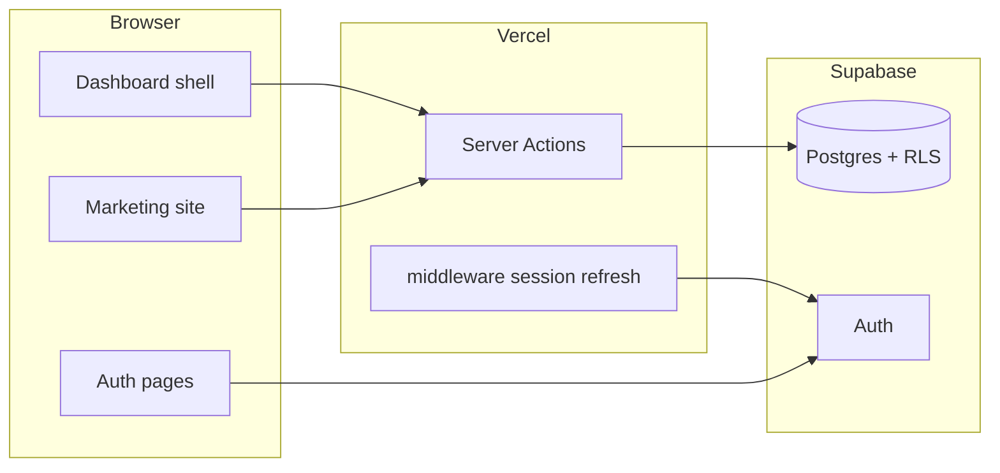

# Architecture

Aquatics Empowered MVP uses **Next.js 15 (App Router)** + **MUI** + **Supabase** + **Vercel**, with **Resend** for transactional email.

See the master blueprint workflow (user layer → frontend → API → Supabase → third parties) in project planning materials.

## Key decisions

- **Multi-tenancy:** `org_id` on tenant tables; isolation via Supabase RLS + JWT claims from `custom_access_token_hook`.
- **Auth:** Magic link (passwordless) via Supabase; SMTP can be pointed at Resend.
- **Marketing vs app:** Route groups `(marketing)` and `(dashboard)` share root layout (MUI theme).

## Diagram

