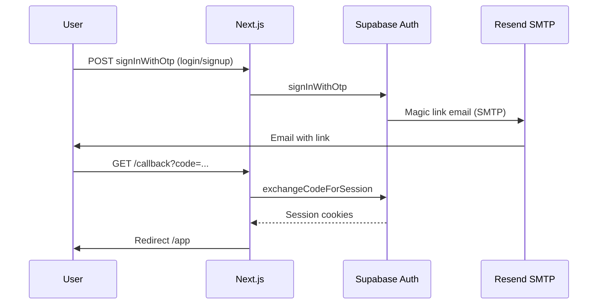

# Auth flow (magic link)

## Sequence

## Notes

- `emailRedirectTo` must be listed under **Authentication → URL Configuration → Redirect URLs** in Supabase (e.g. `http://localhost:3000/callback`, production `https://your-domain/callback`).
- `public.users` is populated by trigger `on_auth_user_created` on `auth.users`.
- JWT custom claims (`org_id`, `user_role`) are added by `public.custom_access_token_hook` after you enable the hook in the Supabase dashboard.

## RLS

- Authenticated users read their own `public.users` row and rows in their organization when `org_id` is present in the JWT.
- Anonymous users can insert into `public.leads` for the founder form.
